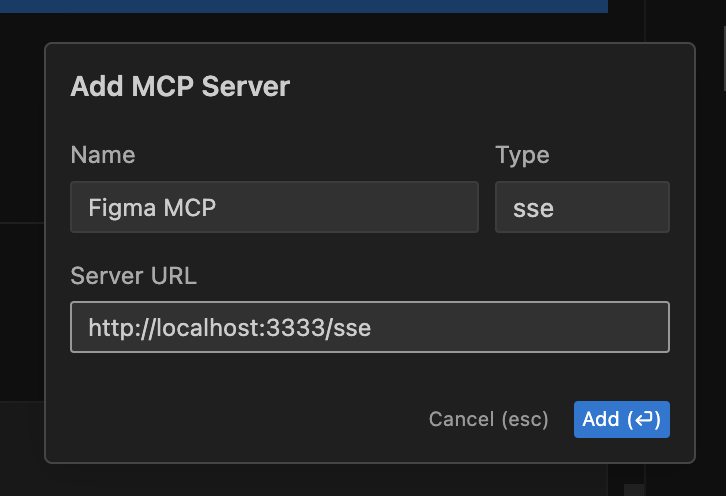
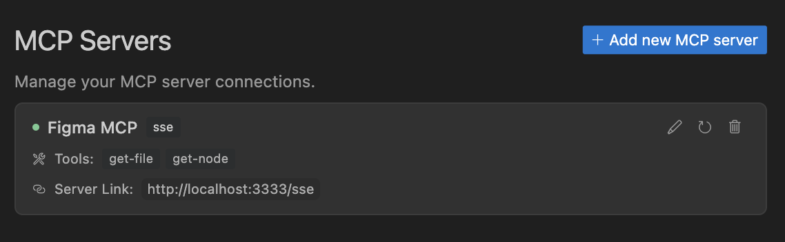
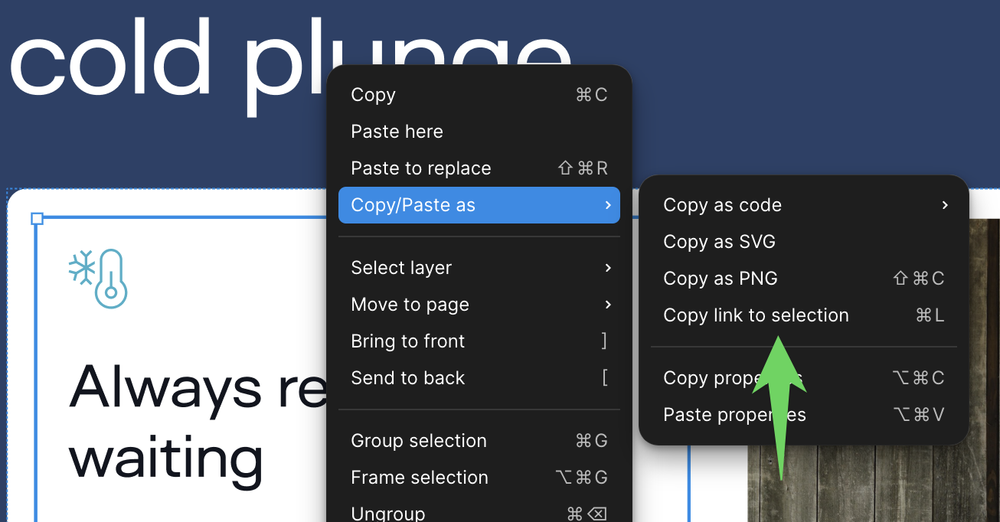

# Figma MCP Server

Give [Cursor](https://cursor.sh/), [Windsurf](https://codeium.com/windsurf), [Cline](https://cline.bot/), and other AI-powered coding tools access to your Figma files with this [Model Context Protocol](https://modelcontextprotocol.io/introduction) server.

When Cursor has access to Figma design data, it's **way** better at one-shotting designs accurately than alternative approaches like pasting screenshots.

Get started quickly, see [Configuration](#configuration) for more details:

```bash
npx figma-developer-mcp --figma-api-key=<your-figma-api-key>
```

## Enhanced CSS Extraction

This enhanced version of the MCP server can extract and provide detailed CSS properties from Figma designs, making it more accurate when translating designs to code.

### Key Features:

- **Detailed CSS Properties**: Extracts exact CSS values for all elements
- **Complete Styling**: Includes colors, dimensions, borders, shadows, typography, and more
- **Accurate Rendering**: Better translation from Figma to code with proper styles instead of screenshots
- **Optional Extraction**: Configure whether to include detailed CSS properties in the response

### Advanced CSS Features:

- **Gradient Support**: Accurate extraction of linear, radial, and conic gradients
- **Multi-layered Backgrounds**: Support for multiple fills with proper stacking order
- **Text Styling**: Complete typography properties including font family, size, weight, line height, and transformations
- **Effects & Filters**: Support for box-shadow, blur effects, and backdrop filters
- **Transformations**: Extracts rotation and scale transforms

### Example Usage:

When requesting Figma data, you can specify whether to extract detailed CSS properties:

```javascript
// With detailed CSS properties
const response = await fetch("http://localhost:3333/messages", {
  method: "POST",
  body: JSON.stringify({
    tool: "get_figma_data",
    params: {
      fileKey: "your-file-key",
      nodeId: "your-node-id",
      extractCssProperties: true // default is true
    }
  })
});

// Without detailed CSS properties (more lightweight)
const response = await fetch("http://localhost:3333/messages", {
  method: "POST",
  body: JSON.stringify({
    tool: "get_figma_data",
    params: {
      fileKey: "your-file-key",
      nodeId: "your-node-id",
      extractCssProperties: false
    }
  })
});
```

## Design Tokens Generation

This enhanced version also includes tools to automatically generate design tokens from your Figma designs, which can be exported in various formats to use in your projects.

### Supported Token Types:

- **Colors**: Extracts colors from fills and named color elements
- **Typography**: Creates complete typography tokens with font families, sizes, weights, etc.
- **Spacing**: Identifies spacing patterns from appropriately named elements
- **Border Radius**: Extracts corner radius values
- **Shadows**: Captures box shadows and elevations
- **Opacity**: Extracts opacity values
- **Gradients**: Saves gradient definitions for reuse

### Export Formats:

- **CSS**: Variables in `:root {}` for direct use in CSS
- **SCSS**: Variables and mixins for SCSS workflows
- **TypeScript**: Type-safe constants with TypeScript types
- **JSON**: Raw data for custom processing

### Example Usage:

```javascript
// Generate design tokens
const response = await fetch("http://localhost:3333/messages", {
  method: "POST",
  body: JSON.stringify({
    tool: "generate_design_tokens",
    params: {
      fileKey: "your-file-key",
      format: "css", // Options: "css", "scss", "ts", "json"
      outputPath: "./src/styles/design-tokens.css", // Optional
      prefix: "my-app-" // Optional prefix for variable names
    }
  })
});
```

## Demo Video

[Watch a demo of building a UI in Cursor with Figma design data](https://youtu.be/6G9yb-LrEqg)
[](https://youtu.be/6G9yb-LrEqg)

<a href="https://glama.ai/mcp/servers/kcftotr525"></a>

## How it works

1. Open Cursor's composer in agent mode.
1. Paste a link to a Figma file, frame, or group.
1. Ask Cursor to do something with the Figma file—e.g. implement a design.
1. Cursor will fetch the relevant metadata from Figma and use it to write your code.

This MCP server is specifically designed for use with Cursor. Before responding with context from the [Figma API](https://www.figma.com/developers/api), it simplifies and translates the response so only the most relevant layout and styling information is provided to the model.

Reducing the amount of context provided to the model helps make the AI more accurate and the responses more relevant.

## Installation

### Running the server quickly with NPM

You can run the server quickly without installing or building the repo using NPM:

```bash
npx figma-developer-mcp --figma-api-key=<your-figma-api-key>

# or
pnpx figma-developer-mcp --figma-api-key=<your-figma-api-key>

# or
yarn dlx figma-developer-mcp --figma-api-key=<your-figma-api-key>

# or
bunx figma-developer-mcp --figma-api-key=<your-figma-api-key>
```

Instructions on how to create a Figma API access token can be found [here](https://help.figma.com/hc/en-us/articles/8085703771159-Manage-personal-access-tokens).

### JSON config for tools that use configuration files

Many tools like Windsurf, Cline, and [Claude Desktop](https://claude.ai/download) use a configuration file to start the server.

The `figma-developer-mcp` server can be configured by adding the following to your configuration file:

```json
{
  "mcpServers": {
    "figma-developer-mcp": {
      "command": "npx",
      "args": ["-y", "figma-developer-mcp", "--stdio"],
      "env": {
        "FIGMA_API_KEY": "<your-figma-api-key>"
      }
    }
  }
}
```

### Running the server from local source

1. Clone the [repository](https://github.com/GLips/Figma-Context-MCP)
2. Install dependencies with `pnpm install`
3. Copy `.env.example` to `.env` and fill in your [Figma API access token](https://help.figma.com/hc/en-us/articles/8085703771159-Manage-personal-access-tokens). Only read access is required.
4. Run the server with `pnpm run dev`, along with any of the flags from the [Command-line Arguments](#command-line-arguments) section.

## Configuration

The server can be configured using either environment variables (via `.env` file) or command-line arguments. Command-line arguments take precedence over environment variables.

### Environment Variables

- `FIGMA_API_KEY`: Your [Figma API access token](https://help.figma.com/hc/en-us/articles/8085703771159-Manage-personal-access-tokens) (required)
- `PORT`: The port to run the server on (default: 3333)

### Command-line Arguments

- `--version`: Show version number
- `--figma-api-key`: Your Figma API access token
- `--port`: The port to run the server on
- `--stdio`: Run the server in command mode, instead of default HTTP/SSE
- `--help`: Show help menu

## Connecting to Cursor

### Start the server

```bash
> npx figma-developer-mcp --figma-api-key=<your-figma-api-key>
# Initializing Figma MCP Server in HTTP mode on port 3333...
# HTTP server listening on port 3333
# SSE endpoint available at http://localhost:3333/sse
# Message endpoint available at http://localhost:3333/messages
```

### Connect Cursor to the MCP server

Once the server is running, [connect Cursor to the MCP server](https://docs.cursor.com/context/model-context-protocol) in Cursor's settings, under the features tab.



After the server has been connected, you can confirm Cursor's has a valid connection before getting started. If you get a green dot and the tools show up, you're good to go!



### Start using Composer with your Figma designs

Once the MCP server is connected, **you can start using the tools in Cursor's composer, as long as the composer is in agent mode.**

Dropping a link to a Figma file in the composer and asking Cursor to do something with it should automatically trigger the `get_figma_data` tool.

Most Figma files end up being huge, so you'll probably want to link to a specific frame or group within the file. With a single element selected, you can hit `CMD + L` to copy the link to the element. You can also find it in the context menu:



Once you have a link to a specific element, you can drop it in the composer and ask Cursor to do something with it.

## Inspect Responses

To inspect responses from the MCP server more easily, you can run the `inspect` command, which launches the `@modelcontextprotocol/inspector` web UI for triggering tool calls and reviewing responses:

```bash
pnpm inspect
# > figma-mcp@0.1.7 inspect
# > pnpx @modelcontextprotocol/inspector
#
# Starting MCP inspector...
# Proxy server listening on port 3333
#
# 🔍 MCP Inspector is up and running at http://localhost:5173 🚀
```

## Available Tools

The server provides the following MCP tools:

### get_figma_data

Fetches information about a Figma file.

Parameters:

- `fileKey` (string): The key of the Figma file to fetch
- `nodeId` (string, optional): The ID of the node to fetch
- `depth` (number, optional): How many levels deep to traverse the node tree
- `extractCssProperties` (boolean, optional): Whether to extract detailed CSS properties for each node (default: true)

### generate_design_tokens

Generates design tokens from a Figma file and exports them to a specific format.

Parameters:

- `fileKey` (string): The key of the Figma file to fetch
- `nodeId` (string, optional): The ID of the node to fetch
- `depth` (number, optional): How many levels deep to traverse the node tree
- `format` (string, optional): The output format for the design tokens (options: "css", "scss", "ts", "json", default: "css")
- `outputPath` (string, optional): The file path to save the design tokens
- `prefix` (string, optional): Optional prefix for variable names (e.g., "my-app-")
